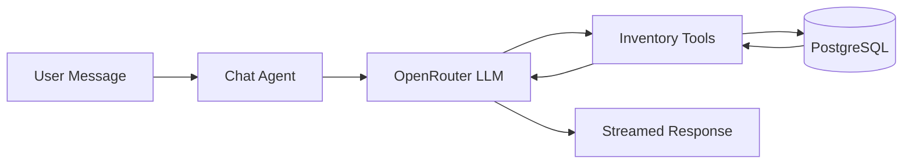

# Mise - Architecture Overview

> **Kitchen Inventory Assistant** with AI-powered chat interface and vision capabilities

## Project Summary

**Mise** is a modern Next.js application that helps users manage their kitchen inventory through an intelligent chat interface with multimodal vision capabilities. The app can analyze images of groceries, receipts, and fridge contents to automatically track inventory, suggest recipes based on available ingredients, and help reduce food waste by highlighting expiring items.

### Key Capabilities

- 📸 **Multimodal Vision**: Upload images of groceries, receipts, or fridge contents for automatic item extraction
- 🤖 **AI Chat Assistant**: Natural language interface powered by OpenRouter (Grok-4-Fast model)
- 📦 **Inventory Management**: Track ingredients with quantities, expiry dates, and categories
- 👨‍🍳 **Recipe Generation**: Get recipe suggestions based on available inventory and expiring items
- 🏠 **Multi-Tenant**: Support for multiple households with profile management (Netflix-style)
- 📱 **Mobile-First**: Chat-centric UI with dashboard views for at-a-glance inventory status

---

## Tech Stack

### Frontend
- **Framework**: Next.js 16.0.5 (App Router with React 19)
- **Styling**: Tailwind CSS 4.0 with custom design system
- **Animations**: Framer Motion
- **UI Components**: Custom components + Radix UI primitives
- **Fonts**: Fraunces (display), DM Sans (body)

### Backend
- **Runtime**: Next.js API Routes (Edge/Node)
- **Database**: PostgreSQL via Drizzle ORM
- **AI Framework**: `@ax-llm/ax` for tool calling orchestration
- **AI Provider**: OpenRouter (grok-4-fast model)
- **Vision**: Native multimodal vision (images sent directly to LLM)
- **Streaming**: Server-Sent Events (SSE) for real-time chat responses

### Data Layer
- **ORM**: Drizzle ORM with PostgreSQL dialect
- **Migrations**: Drizzle Kit
- **Schema**: Multi-tenant with relational data models

### DevOps
- **Testing**: Jest with React Testing Library
- **Deployment**: Vercel (configured via `.vercel` directory)
- **Version Control**: Git (see `.git` directory)

---

## Core Concepts

### 1. Multi-Tenant Architecture

The app uses a **household-based multi-tenancy model**:

```
Household (1)
  └─ Profiles (Many) - Netflix-style user profiles
  └─ Master Ingredients (Many) - Canonical ingredient database
  └─ Containers (Many) - Physical inventory items
```

Each household has its own:
- Ingredient catalog with custom aliases
- Inventory containers and contents
- Cooked recipes and leftovers
- Transaction audit trail

### 2. Inventory Data Model

The inventory system uses a **container-contents pattern**:

- **Master Ingredients**: Canonical ingredient definitions (e.g., "milk", "broccoli")
- **Ingredient Aliases**: Maps variations to master items (e.g., "whole milk" → "milk")
- **Containers**: Physical packages/items in the kitchen (status: SEALED, OPEN, LOW, EMPTY)
- **Contents**: Current quantity remaining in each container
- **Transactions**: Audit log of all inventory changes

### 3. AI Agent System

The chat agent uses **tool calling** to interact with the database:



**Available Tools**:
- `searchInventory` - Query inventory by name, category, status
- `addInventory` - Add new items (groceries, purchases)
- `addLeftover` - Track cooked dishes
- `deductInventory` - Use/consume ingredients
- `updateInventory` - Modify quantities, status, expiry
- `deleteInventory` - Remove items (discarded, expired)
- `mergeInventory` - Consolidate containers
- `getExpiringItems` - Find items expiring soon
- `resolveIngredient` - Normalize ingredient names
- `generateRecipe` - Create recipes from available items

### 4. Multimodal Vision

Instead of using a separate `parseImage` tool, the agent **directly analyzes images** using the LLM's native vision capabilities:

- User uploads image (camera/gallery)
- Frontend converts to base64
- Chat agent sends image alongside text prompt to LLM
- LLM "sees" the image and describes/extracts items
- Agent proactively offers to add items to inventory

---

## Directory Structure

```
/meal-app
├── src/
│   ├── app/                    # Next.js App Router
│   │   ├── page.tsx            # Main entry point
│   │   ├── layout.tsx          # Root layout
│   │   ├── globals.css         # Global styles + design system
│   │   ├── api/v1/            # API routes
│   │   │   ├── chat/           # Chat SSE endpoint
│   │   │   └── inventory/      # Inventory endpoints
│   │   └── profiles/           # Profile management pages
│   │
│   ├── components/             # React components
│   │   ├── chat/               # Chat UI (container, input, bubbles, cards)
│   │   ├── inventory/          # Inventory UI (sheet, items, tabs)
│   │   ├── dashboard/          # Dashboard views (leftovers, expiring)
│   │   ├── alerts/             # Expiring banner
│   │   ├── layout/             # Navigation, header
│   │   ├── profiles/           # Profile switcher, cards, modals
│   │   └── ui/                 # Base UI primitives (badge, skeleton)
│   │
│   ├── agent/                  # AI agent logic
│   │   ├── chatAgent.ts        # Main agent orchestrator
│   │   ├── tools/              # Tool definitions \u0026 implementations
│   │   └── signatures/         # AI signatures (parseImage, generateRecipe)
│   │
│   ├── db/                     # Database layer
│   │   ├── schema.ts           # Drizzle schema definitions
│   │   ├── index.ts            # Database client
│   │   ├── seed.ts             # Seed data
│   │   └── supabase.ts         # Supabase client (if used)
│   │
│   ├── hooks/                  # React hooks
│   │   ├── useChat.ts          # SSE chat streaming
│   │   └── useInventory.ts     # Inventory data fetching
│   │
│   ├── lib/                    # Utilities
│   │   ├── types.ts            # TypeScript type definitions
│   │   ├── constants.ts        # App constants
│   │   ├── api-client.ts       # API client utilities
│   │   ├── sse-parser.ts       # SSE parsing utilities
│   │   ├── image-utils.ts      # Image processing
│   │   ├── retry.ts            # Retry logic
│   │   └── utils.ts            # General utilities
│   │
│   └── contexts/               # React context providers
│
├── public/                     # Static assets
├── drizzle/                    # Database migrations (generated)
├── .next/                      # Next.js build output
├── docs/                       # 📚 PROJECT DOCUMENTATION (NEW)
└── [config files]              # package.json, tsconfig.json, etc.
```

---

## Key Features

### Chat-First Interface

The app centers on a **conversational UI**:

1. User types or uploads an image
2. Agent streams response via SSE
3. Tool calls shown as structured actions
4. Recipe cards and confirmations embedded in chat

### Vision-Powered Inventory Tracking

**Use Cases**:
- 📸 **Grocery Photo**: "I bought some groceries" + image → Agent extracts items and offers to add
- 🧾 **Receipt Photo**: Upload receipt → Parse items with quantities
- 🥗 **Meal Photo**: "Leftovers to track" → Estimate portions and expiry
- 🏪 **Fridge Photo**: Scan fridge contents → Comprehensive inventory snapshot

### Smart Recipe Suggestions

Agent generates recipes that:
- ✅ Prioritize expiring ingredients (reduce waste)
- ✅ Use available inventory
- ✅ Respect user constraints (time, servings, dietary)
- ✅ Show in-stock vs. missing ingredients

### Mobile-Optimized UI

- **Bottom Navigation**: Kitchen (Dashboard) | Assistant (Chat)
- **Swipe Gestures**: Inventory drawer, profile switcher
- **Safe Area Insets**: Respects notch, home indicator
- **Responsive Design**: Works on mobile, tablet, desktop

---

## Design System

### Color Palette (Culinary Editorial Theme)

```css
/* Base */
--color-cream: #FDF6E3;
--color-clay: #D4A574;

/* Accents */
--color-tomato: #E63946;    /* Urgent expiry */
--color-citrus: #FF8C42;    /* Expiring soon */
--color-herb: #2D5016;      /* Fresh/OK */
--color-eggplant: #5B2C6F;

/* Neutrals */
--color-charcoal: #2C3E50;
--color-warm-gray: #8B8680;
```

### Typography

- **Display**: Fraunces (serif, 400/600/700)
- **Body**: DM Sans (sans-serif, 400/500/600)
- **Scale**: Modular scale from 12px to 32px

### Component Patterns

- **Message Bubbles**: User (herb background, right-aligned) | Assistant (cream, left-aligned)
- **Inventory Items**: Color-coded by expiry (tomato/citrus/herb)
- **Recipe Cards**: Expandable inline cards with ingredient checklists
- **Status Badges**: SEALED (green), OPEN (yellow), LOW (red)

---

## Data Flow

### Chat Flow (SSE Streaming)

```
User Input → POST /api/v1/chat
           → streamChatAgent()
           → OpenRouter LLM (with tools)
           → SSE events: thinking, tool_start, tool_end, stream, complete
           → Frontend updates UI in real-time
```

### Inventory Query Flow

```
GET /api/v1/inventory/summary
  → searchInventory({ status: ['SEALED', 'OPEN', 'LOW'] })
  → getExpiringItems(3)
  → Group by category
  → Return summary { expiringSoon, categories, leftovers, totalCount }
```

### Tool Execution Flow

```
1. Agent receives user message
2. LLM decides to call tool (e.g., addInventory)
3. Tool wrapper emits 'tool_start' event
4. Tool function executes (database write)
5. Tool wrapper emits 'tool_end' event with result
6. LLM incorporates result into response
7. Agent streams final response to user
```

---

## Environment Variables

See `.env.example` and `.env.local.example` for required configuration:

```bash
# Database
DATABASE_URL=postgresql://...

# AI Provider
OPENROUTER_API_KEY=sk-or-v1-...

# App Config
NEXT_PUBLIC_APP_URL=http://localhost:3000

# Optional: Supabase (if using auth)
NEXT_PUBLIC_SUPABASE_URL=...
NEXT_PUBLIC_SUPABASE_ANON_KEY=...
```

---

## Getting Started

```bash
# Install dependencies
npm install

# Set up environment variables
cp .env.example .env.local
# Edit .env.local with your DATABASE_URL and OPENROUTER_API_KEY

# Run database migrations
npx drizzle-kit push

# Seed database (optional)
npm run seed

# Start development server
npm run dev
```

Open [http://localhost:3000](http://localhost:3000)

---

## Next Steps

👉 Explore detailed documentation in `/docs`:

- **[Database Schema](./database-schema.md)** - Complete data model reference
- **[API Reference](./api-reference.md)** - All API endpoints and contracts
- **[Component Guide](./component-guide.md)** - UI component architecture
- **[Agent System](./agent-system.md)** - AI tool calling and vision capabilities
- **[Configuration](./configuration.md)** - Environment setup and deployment

---

## Contributing

This codebase follows:
- **TypeScript strict mode**
- **React 19** best practices
- **Server Components** where applicable
- **SSE streaming** for real-time updates
- **Tool calling** for structured AI outputs

See individual documentation files for implementation details and best practices.
