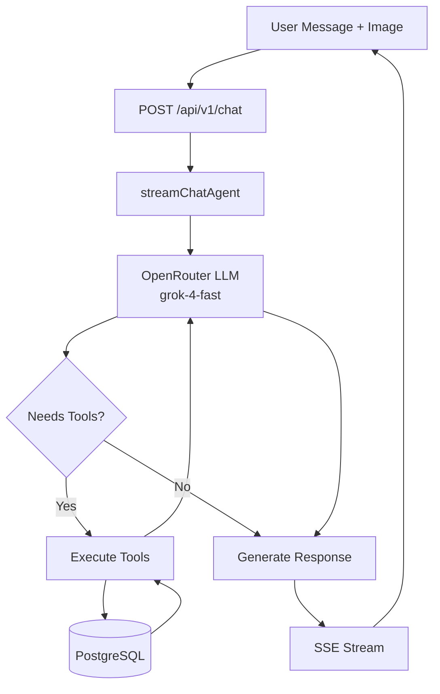

# AI Agent System

Complete guide to the AI-powered chat agent and tool calling system.

## Overview

The Mise chat agent uses **OpenRouter** (Grok-4-Fast model) with **multimodal vision** and **structured tool calling** to help users manage their kitchen inventory through natural language conversations.



---

## Architecture

### Components

1. **Chat Agent** (`src/agent/chatAgent.ts`)
   - Orchestrates LLM interactions
   - Wraps tools to emit events
   - Streams responses via SSE

2. **Tool Definitions** (`src/agent/tools/definitions.ts`)
   - JSON schemas for tool parameters
   - Wrapper functions that emit events
   - Type-safe tool implementations

3. **Tool Implementations** (`src/agent/tools/inventory.ts`)
   - Core business logic
   - Database interactions via Drizzle ORM
   - Ingredient resolution and normalization

4. **AI Signatures** (`src/agent/signatures/`)
   - `parseImage.ts` - Vision extraction (legacy, now handled by LLM)
   - `generateRecipe.ts` - Recipe generation logic

---

## Agent Initialization

```typescript
// Lazy initialization to avoid build-time errors
let _llm: ReturnType<typeof ai> | null = null;

function getLlm() {
  const apiKey = process.env.OPENROUTER_API_KEY;
  if (!apiKey) {
    throw new Error("OPENROUTER_API_KEY not set");
  }

  if (!_llm) {
    _llm = ai({
      name: "openrouter",
      apiKey,
      config: { model: "x-ai/grok-4-fast" },
      referer: process.env.NEXT_PUBLIC_APP_URL || "http://localhost:3000",
      title: "Mise Kitchen Assistant",
    });
  }
  return _llm;
}
```

**Why Lazy Init?**
- Avoids Next.js build-time environment variable errors
- LLM client created only when chat endpoint is called
- Prevents edge runtime issues

---

## System Prompt

The agent's personality and behavior are defined in `SYSTEM_PROMPT`:

### Key Directives

1. **Reasoning Approach**: Think step-by-step before acting
2. **Response Formatting**: Use markdown strategically (bold, lists, headers)
3. **Image Analysis**: Proactively offer to add items from images
4. **Read Before Write**: Always check inventory before adding/deducting
5. **Tool Workflows**: Follow structured patterns for common tasks
6. **Quantity Interpretation**: Parse natural language quantities
7. **Error Handling**: Explain failures clearly and suggest alternatives

### Example Prompt Excerpt

```
IMAGE ANALYSIS - BE PROACTIVE ABOUT INVENTORY:
When the user shares a food-related image, your PRIMARY goal is to help them track it in their inventory.

1. GROCERIES/PRODUCE/FRIDGE PHOTO:
   Immediately identify items and PROACTIVELY suggest adding them:
   
   "I can see some fresh groceries! Here's what I found:
   
   ### Ready to Add
   | Item | Qty | Unit | Category |
   |------|-----|------|----------|
   | **Broccoli** | 2 | heads | Produce |
   | **Bell Peppers** | 3 | count | Produce |
   
   **Want me to add these to your inventory?** Just say 'yes'!"
```

---

## Multimodal Vision

The agent **natively supports image inputs** via the LLM's vision capabilities.

### How It Works

1. **Frontend**: User uploads image (camera/gallery)
2. **Conversion**: Image converted to base64 data URL
3. **API Request**: Base64 sent with message to `/api/v1/chat`
4. **Agent**: Builds multimodal content array:
   ```typescript
   const content: (TextContent | ImageUrlContent)[] = [
     { type: "text", text: "What's in this image?" },
     {
       type: "image_url",
       image_url: {
         url: "data:image/jpeg;base64,/9j/4AAQ...",
         detail: "high"
       }
     }
   ];
   ```
5. **LLM**: "Sees" the image and extracts items
6. **Agent**: Offers to add items to inventory

### Supported Image Types

- **Groceries/Produce**: Identify items, quantities, categories
- **Receipts**: Parse line items with quantities
- **Meals**: Distinguish between leftovers vs. recipe inspiration
- **Fridge Contents**: Comprehensive inventory snapshot

### Image Detail Levels

- `high` (default): Better food/receipt analysis
- `low`: Faster, cheaper, less accurate
- `auto`: LLM decides based on image

---

## Tool Calling System

### Tool Definition Format

Tools are defined using the `AxFunction` interface:

```typescript
export const searchInventoryTool: AxFunction = {
  name: "searchInventory",
  description: "Search the kitchen inventory. Use this to find items...",
  parameters: {
    type: "object",
    properties: {
      query: { type: "string", description: "Search term" },
      category: { type: "string", enum: ["produce", "protein", ...] },
      status: { type: "array", items: { type: "string", enum: [...] } },
      // ...
    },
    required: [],
  } as AxFunctionJSONSchema,
  func: async (args) => {
    const results = await searchInventory({
      query: args?.query,
      category: args?.category as IngredientCategory,
      // ...
    });
    return { count: results.length, items: results };
  },
};
```

### Tool Event Wrapping

Tools are wrapped to emit `tool_start` and `tool_end` events:

```typescript
const wrappedTools = inventoryTools.map((tool) => ({
  ...tool,
  func: async (args: any, extra: any) => {
    const toolId = `tool_${++toolCounter}_${Date.now()}`;
    
    // Emit tool_start
    pendingEvents.push({
      type: "tool_start",
      id: toolId,
      name: tool.name,
      args,
    });
    
    try {
      const result = await tool.func(args, extra);
      
      // Emit tool_end
      pendingEvents.push({
        type: "tool_end",
        id: toolId,
        name: tool.name,
        result,
      });
      
      return result;
    } catch (error) {
      // Emit tool_end with error
      pendingEvents.push({
        type: "tool_end",
        id: toolId,
        name: tool.name,
        error: error.message,
      });
      throw error;
    }
  },
}));
```

### Available Tools

See [API Reference - Agent Tools](./api-reference.md#agent-tool-functions) for complete list.

**Core Inventory Tools**:
- `searchInventory` - Query/filter inventory
- `addInventory` - Add items (batch)
- `addLeftover` - Add cooked dishes
- `deductInventory` - Consume/use ingredients
- `updateInventory` - Modify item details
- `deleteInventory` - Remove items
- `mergeInventory` - Consolidate containers
- `getExpiringItems` - Find expiring items
- `resolveIngredient` - Normalize ingredient names

**Recipe Tools**:
- `generateRecipe` - Create recipes from inventory

**Vision Tools** (legacy, now handled by native vision):
- `parseImage` - Extract items from images

---

## Agent Workflows

### Adding Groceries Workflow

```
User: "I bought milk, eggs, and broccoli"
      
Agent: [searchInventory({ query: "milk" })]
       → Result: Found 1 milk (0.5 gal, expires in 2 days)
       
Agent: [searchInventory({ query: "eggs" })]
       → Result: None found
       
Agent: [searchInventory({ query: "broccoli" })]
       → Result: None found
       
Agent Response:
  "You already have **0.5 gal milk** that expires in 2 days.
   
   Want me to add:
   - **Eggs** (estimate: 12 count)
   - **Broccoli** (estimate: 1 bunch)
   
   Let me know quantities to confirm!"

User: "yes, 1 dozen eggs and 2 broccoli heads"

Agent: [addInventory({
         items: [
           { name: "eggs", quantity: 12, unit: "count", category: "protein" },
           { name: "broccoli", quantity: 2, unit: "heads", category: "produce" }
         ]
       })]
       → Result: Created 2 items
       
Agent Response:
  "✅ Added **12 eggs** and **2 broccoli** to your inventory!"
```

### Image Analysis Workflow

```
User: [Uploads image of groceries]

Agent: [Analyzes image via native vision]
       → Sees: 2 bell peppers, 1 lb chicken breast, bag of spinach
       
Agent Response:
  "I can see some fresh groceries! Here's what I found:
   
   ### Ready to Add
   | Item | Qty | Unit | Category |
   |------|-----|------|----------|
   | **Bell Peppers** | 2 | count | Produce |
   | **Chicken Breast** | 1 | lb | Protein |
   | **Spinach** | 1 | bag | Produce |
   
   **Want me to add these to your inventory?** Just say 'yes'!"

User: "yes"

Agent: [addInventory({ items: [...] })]
       
Agent Response:
  "✅ Added 3 items to your inventory!"
```

### Recipe Generation Workflow

```
User: "What can I cook tonight?"

Agent: [getExpiringItems(5)]
       → Result: [milk (2 days), spinach (1 day), chicken (3 days)]
       
Agent: [searchInventory({ status: ['SEALED', 'OPEN', 'LOW'] })]
       → Result: [...full inventory...]
       
Agent: [generateRecipe(inventory, expiringItems, { maxTimeMins: 30 })]
       → Result: {
           title: "Spinach Chicken Skillet",
           ingredients: [...],
           steps: [...],
           timeEstimateMins: 25,
           usesExpiring: ["spinach", "chicken", "milk"]
         }
       
Agent Response:
  "### Spinach Chicken Skillet
   ⏱️ 25 minutes • 🎯 Uses expiring ingredients
   
   **Ingredients**:
   - ✅ **1 lb chicken breast** (you have 1 lb)
   - ✅ **2 cups spinach** (you have 1 bag)
   - ✅ **1/2 cup milk** (you have 0.5 gal)
   - ❌ **1 tbsp olive oil** (not in stock)
   
   **Steps**:
   1. Heat olive oil in a skillet...
   2. Season chicken with salt and pepper...
   ..."
```

---

## Streaming Implementation

The agent uses **Server-Sent Events (SSE)** for real-time streaming:

### Server Side

```typescript
export async function* streamChatAgent(input: ChatAgentInput) {
  yield { type: "thinking", status: "Looking at your image..." };
  
  // ... tool calls emit tool_start/tool_end events
  
  const response = await llm.chat({ chatPrompt, functions, functionCall: "auto" });
  const content = response.results?.[0]?.content || "";
  
  // Stream character by character
  for (const char of content) {
    yield { type: "stream", token: char, index: ++tokenIndex };
  }
  
  yield { type: "complete", success: true };
}
```

### Client Side (Frontend)

```typescript
const response = await fetch('/api/v1/chat', {
  method: 'POST',
  body: JSON.stringify({ message, conversationHistory })
});

const reader = response.body.getReader();
const decoder = new TextDecoder();

while (true) {
  const { done, value } = await reader.read();
  if (done) break;
  
  const chunk = decoder.decode(value);
  // Parse SSE format: "event: {type}\ndata: {json}\n\n"
  // Update UI based on event type
}
```

See `src/hooks/useChat.ts` for full implementation.

---

## Ingredient Resolution

The agent uses **fuzzy matching** to normalize ingredient names:

### Resolution Flow

```
User input: "whole milk"
  ↓
1. Check alias table: "whole milk" → Found: "milk"
  ↓
2. Return: { matchType: "alias", masterId: "milk", canonicalName: "Milk" }

User input: "brocoli" (typo)
  ↓
1. Check alias table: "brocoli" → Not found
  ↓
2. Fuzzy match: "brocoli" → "broccoli" (confidence: 0.85)
  ↓
3. Return: { matchType: "fuzzy", masterId: "broccoli", canonicalName: "Broccoli", confidence: 0.85 }

User input: "dragonfruit"
  ↓
1. Check alias table: Not found
  ↓
2. Fuzzy match: No close matches
  ↓
3. Create new master ingredient: "dragonfruit"
  ↓
4. Return: { matchType: "exact", masterId: "dragonfruit", canonicalName: "Dragonfruit" }
```

### Benefits

- ✅ Handles user typos gracefully
- ✅ Learns from user corrections
- ✅ Supports regional name variations
- ✅ Agent-managed canonical catalog

---

## Error Handling

The agent handles errors at multiple levels:

### Tool Execution Errors

```typescript
try {
  const result = await deductInventory({ masterId, quantity, unit, reason });
  return { success: true, ...result };
} catch (error) {
  return {
    success: false,
    error: error.message  // e.g., "Insufficient quantity"
  };
}
```

### Agent-Level Errors

```typescript
catch (error) {
  console.error("Chat agent error:", error);
  yield {
    type: "error",
    message: error instanceof Error ? error.message : "An error occurred"
  };
}
```

### User-Facing Messages

Agent translates errors into helpful messages:

```
Tool Error: "Insufficient quantity"
Agent Response: "You only have **1 egg** but need 3. Want to update your shopping list?"

Tool Error: "Item not found"
Agent Response: "I couldn't find **dragonfruit** in your inventory. Would you like to add it?"
```

---

## Configuration

### Environment Variables

```bash
# Required
OPENROUTER_API_KEY=sk-or-v1-...

# Optional
NEXT_PUBLIC_APP_URL=http://localhost:3000  # For OpenRouter referer
```

### Model Selection

Currently hardcoded to `x-ai/grok-4-fast`. To change:

```typescript
// src/agent/chatAgent.ts
_llm = ai({
  name: "openrouter",
  apiKey,
  config: {
    model: "anthropic/claude-3.5-sonnet",  // Change model here
  },
  // ...
});
```

**Recommended Models**:
- `x-ai/grok-4-fast` (current) - Fast, cost-effective
- `anthropic/claude-3.5-sonnet` - Better reasoning
- `openai/gpt-4o` - Strong multimodal capabilities

---

## Performance Optimization

### Streaming vs. Non-Streaming

- **Streaming**: Real-time feedback, better UX
- **Non-Streaming**: Simpler client, can retry easily

Currently using character-by-character streaming for smoother UX.

### Tool Call Batching

Agent can call multiple tools in parallel:

```typescript
const [inventory, expiring] = await Promise.all([
  searchInventory({ status: ["SEALED", "OPEN", "LOW"] }),
  getExpiringItems(5)
]);
```

### Caching Considerations

- **Inventory queries**: Cache for 30-60 seconds (dashboard)
- **Agent responses**: Do NOT cache (personalized, non-deterministic)
- **Tool results**: Cache ingredient resolution (reduce DB hits)

---

## Testing

### Unit Tests (Tool Functions)

```typescript
describe('searchInventory', () => {
  it('filters by category', async () => {
    const results = await searchInventory({ category: 'produce' });
    expect(results.every(item => item.category === 'produce')).toBe(true);
  });
});
```

### Integration Tests (Agent)

```typescript
describe('Chat Agent', () => {
  it('adds inventory from user message', async () => {
    const result = await runChatAgent({
      message: 'I bought 2 apples'
    });
    
    expect(result.toolEvents).toContainEqual(
      expect.objectContaining({ name: 'addInventory' })
    );
  });
});
```

### E2E Tests (Browser)

Test full chat flow with real SSE streaming:

```typescript
test('uploads image and extracts items', async ({ page }) => {
  await page.goto('/');
  await page.locator('input[type="file"]').setInputFiles('groceries.jpg');
  await page.locator('button[type="submit"]').click();
  
  await expect(page.locator('.thinking-indicator')).toBeVisible();
  await expect(page.locator('.message-bubble')).toContainText('Ready to Add');
});
```

---

## Future Enhancements

### Multi-Turn Context

Currently, conversation history is sent with each request. Future improvements:
- Server-side session management
- Context window optimization (summarize old messages)
- Persistent chat history in database

### Function Calling Improvements

- **Parallel tool execution**: Run independent tools concurrently
- **Tool chaining**: Automatically use output of one tool as input to another
- **Custom tool validation**: Validate tool outputs before returning to LLM

### Vision Enhancements

- **OCR fallback**: Use Tesseract for receipt parsing if vision fails
- **Multi-image support**: Analyze multiple images in one request
- **Image preprocessing**: Auto-crop, enhance, rotate images

### Agent Personalization

- **User preferences**: Dietary restrictions, favorite cuisines
- **Learning**: Remember user corrections to ingredient names
- **Proactive suggestions**: "You usually cook on Fridays, want a recipe?"

---

## Related Documentation

- [API Reference](./api-reference.md) - Agent tool definitions
- [Database Schema](./database-schema.md) - Data models for tools
- [Component Guide](./component-guide.md) - Frontend integration
