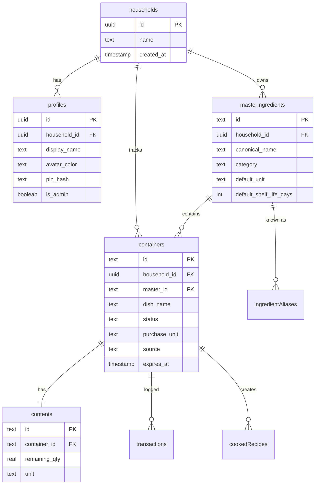

# Database Schema Reference

This document describes the complete database schema for the Mise application.

## Database Technology

- **DBMS**: PostgreSQL
- **ORM**: Drizzle ORM
- **Migration Tool**: Drizzle Kit
- **Connection**: Via `DATABASE_URL` environment variable

---

## Schema Overview

The database follows a **multi-tenant architecture** with households as the top-level tenant entity. All data is scoped to households to ensure proper data isolation.



---

## Table Definitions

### 1. `households`

**Purpose**: Top-level tenant entity. One authenticated user = one household.

| Column | Type | Constraints | Description |
|--------|------|-------------|-------------|
| `id` | `uuid` | PRIMARY KEY | Matches `auth.users.id` from authentication system |
| `name` | `text` | NOT NULL, DEFAULT 'My Household' | Display name for the household |
| `created_at` | `timestamp` | DEFAULT NOW() | Household creation timestamp |

**Relations**:
- Has many `profiles`
- Has many `masterIngredients`
- Has many `containers`

**Indexes**: None specified (PK automatically indexed)

---

### 2. `profiles`

**Purpose**: Netflix-style user profiles within a household. Allows multiple family members to use the app.

| Column | Type | Constraints | Description |
|--------|------|-------------|-------------|
| `id` | `uuid` | PRIMARY KEY, DEFAULT random | Unique profile identifier |
| `household_id` | `uuid` | NOT NULL, FK → `households.id`, CASCADE | Parent household |
| `display_name` | `text` | NOT NULL | User's display name |
| `avatar_color` | `text` | NOT NULL, DEFAULT 'terracotta' | Color theme for avatar |
| `pin_hash` | `text` | NULLABLE | Optional PIN for profile protection |
| `is_admin` | `boolean` | DEFAULT false | Admin privileges flag |
| `created_at` | `timestamp` | DEFAULT NOW() | Profile creation timestamp |

**Relations**:
- Belongs to one `household`

**Business Logic**:
- If `pin_hash` is NULL → no PIN required
- Admin profiles may have elevated permissions (TBD in app logic)

---

### 3. `masterIngredients`

**Purpose**: Canonical ingredient catalog, dynamically built by the AI agent. Household-scoped to allow custom ingredients.

| Column | Type | Constraints | Description |
|--------|------|-------------|-------------|
| `id` | `text` | PRIMARY KEY | Slug-style ID (e.g., "milk", "chicken-breast") |
| `household_id` | `uuid` | FK → `households.id`, CASCADE | Owning household (NULL for global ingredients) |
| `canonical_name` | `text` | NOT NULL | Standard name (e.g., "Milk") |
| `category` | `text` | NULLABLE | Category: produce, protein, dairy, pantry, frozen, beverage |
| `default_unit` | `text` | NULLABLE | Default measurement unit (g, ml, count) |
| `default_shelf_life_days` | `integer` | NULLABLE | Typical shelf life in days |
| `created_at` | `timestamp` | DEFAULT NOW() | When ingredient was first cataloged |

**Relations**:
- Belongs to one `household`
- Has many `ingredientAliases`
- Has many `containers`

**Usage**:
- Agent dynamically creates new master ingredients when encountering unknown items
- Provides normalization for inventory queries (e.g., "whole milk" → "milk")

---

### 4. `ingredientAliases`

**Purpose**: Maps alternative names to canonical ingredients (e.g., "2% milk" → "milk").

| Column | Type | Constraints | Description |
|--------|------|-------------|-------------|
| `alias` | `text` | PRIMARY KEY | Alternative name or misspelling |
| `household_id` | `uuid` | FK → `households.id`, CASCADE | Owning household |
| `master_id` | `text` | NOT NULL, FK → `masterIngredients.id` | Canonical ingredient |
| `source` | `text` | DEFAULT 'agent' | How alias was created: `agent`, `user_correction` |
| `created_at` | `timestamp` | DEFAULT NOW() | Alias creation time |

**Relations**:
- Belongs to one `masterIngredient`

**Examples**:
- `"whole milk"` → `master_id: "milk"`
- `"chicken breast"` → `master_id: "chicken-breast"`
- `"broccoli florets"` → `master_id: "broccoli"`

---

### 5. `globalUnitConversions`

**Purpose**: Household-specific unit conversion factors.

| Column | Type | Constraints | Description |
|--------|------|-------------|-------------|
| `id` | `text` | PRIMARY KEY | Composite key: `"from_unit:to_unit"` (e.g., `"lb:kg"`) |
| `household_id` | `uuid` | FK → `households.id`, CASCADE | Owning household |
| `from_unit` | `text` | NOT NULL | Source unit |
| `to_unit` | `text` | NOT NULL | Target unit |
| `factor` | `real` | NOT NULL | Conversion multiplier |

**Example Rows**:
| id | from_unit | to_unit | factor |
|----|-----------|---------|--------|
| `lb:kg` | `lb` | `kg` | `0.453592` |
| `oz:g` | `oz` | `g` | `28.3495` |

---

### 6. `containers`

**Purpose**: Physical inventory items (packages, jars, bags, dishes). Represents the "container" in the inventory system.

| Column | Type | Constraints | Description |
|--------|------|-------------|-------------|
| `id` | `text` | PRIMARY KEY | Unique container identifier |
| `household_id` | `uuid` | FK → `households.id`, CASCADE | Owning household |
| `master_id` | `text` | FK → `masterIngredients.id`, NULLABLE | Canonical ingredient (NULL for leftovers) |
| `dish_name` | `text` | NULLABLE | For leftovers only: name of cooked dish |
| `cooked_from_recipe_id` | `text` | NULLABLE | Recipe ID if this is a leftover from a cooked recipe |
| `status` | `text` | NOT NULL, DEFAULT 'SEALED' | SEALED, OPEN, LOW, EMPTY, DELETED |
| `purchase_unit` | `text` | NULLABLE | Package type: bag, carton, bottle, bunch, can, box, piece |
| `source` | `text` | NOT NULL | How item was added: `vision`, `manual`, `cooked` |
| `confidence` | `text` | NULLABLE | Vision extraction confidence: `high`, `medium`, `low` |
| `vision_job_id` | `text` | NULLABLE | ID of vision extraction job (for debugging) |
| `expires_at` | `timestamp` | NULLABLE | Calculated or user-provided expiry date |
| `created_at` | `timestamp` | DEFAULT NOW() | When item was added to inventory |
| `updated_at` | `timestamp` | DEFAULT NOW() | Last modification time |

**Relations**:
- Belongs to one `household`
- Belongs to one `masterIngredient` (nullable for leftovers)
- Has one `contents` record
- Has many `transactions`

**Status Flow**:
```
SEALED → OPEN → LOW → EMPTY → DELETED
           ↓
         (user deducts)
```

---

### 7. `contents`

**Purpose**: Current quantity remaining in a container. Separated for efficient updates without touching container metadata.

| Column | Type | Constraints | Description |
|--------|------|-------------|-------------|
| `id` | `text` | PRIMARY KEY | Unique contents identifier |
| `container_id` | `text` | NOT NULL, UNIQUE, FK → `containers.id`, CASCADE | Parent container (1:1 relationship) |
| `remaining_qty` | `real` | NOT NULL | Current quantity remaining |
| `unit` | `text` | NOT NULL | Measurement unit: g, ml, count, cups, serving, portion |
| `updated_at` | `timestamp` | DEFAULT NOW() | Last quantity update time |

**Relations**:
- Belongs to one `container` (1:1)

**Usage**:
- When deducting inventory, only `remaining_qty` and `updated_at` are modified
- Unit conversions may be applied based on `globalUnitConversions`

---

### 8. `transactions`

**Purpose**: Immutable audit log of all inventory changes. Enables undo, reporting, and analytics.

| Column | Type | Constraints | Description |
|--------|------|-------------|-------------|
| `id` | `text` | PRIMARY KEY | Unique transaction identifier |
| `household_id` | `uuid` | FK → `households.id`, CASCADE | Owning household |
| `container_id` | `text` | NOT NULL, FK → `containers.id` | Affected container |
| `operation` | `text` | NOT NULL | Operation type (see below) |
| `delta` | `real` | NULLABLE | Quantity change (positive or negative) |
| `unit` | `text` | NULLABLE | Unit of `delta` |
| `reason` | `text` | NULLABLE | User-provided or agent-generated reason |
| `created_at` | `timestamp` | DEFAULT NOW() | Transaction timestamp |

**Operation Types**:
- `ADD` - New item added to inventory
- `DEDUCT` - Consumed or used
- `ADJUST` - Manual quantity correction
- `MERGE` - Combined two containers
- `DELETE` - Item discarded or removed
- `STATUS_CHANGE` - Status updated (e.g., SEALED → OPEN)

**Relations**:
- Belongs to one `household`
- Belongs to one `container`

**Example Transactions**:
| operation | delta | unit | reason |
|-----------|-------|------|--------|
| `ADD` | `2.0` | `lb` | `vision_scan` |
| `DEDUCT` | `-0.5` | `lb` | `cooked dinner` |
| `STATUS_CHANGE` | NULL | NULL | `opened package` |
| `DELETE` | `-1.5` | `lb` | `expired` |

---

### 9. `cookedRecipes`

**Purpose**: History of recipes that were cooked. Links to leftover containers created from the recipe.

| Column | Type | Constraints | Description |
|--------|------|-------------|-------------|
| `id` | `text` | PRIMARY KEY | Unique recipe history identifier |
| `household_id` | `uuid` | FK → `households.id`, CASCADE | Owning household |
| `title` | `text` | NOT NULL | Recipe title (e.g., "Chicken Stir Fry") |
| `ingredients_used` | `text` | NULLABLE | JSON string of ingredients with quantities |
| `leftovers_created_id` | `text` | FK → `containers.id`, NULLABLE | Container ID of leftover dish created |
| `created_at` | `timestamp` | DEFAULT NOW() | When recipe was cooked |

**Relations**:
- Belongs to one `household`
- May link to one `container` (leftovers)

**Example `ingredients_used` JSON**:
```json
[
  { "name": "chicken breast", "qty": 1.5, "unit": "lb" },
  { "name": "broccoli", "qty": 2, "unit": "cups" },
  { "name": "soy sauce", "qty": 2, "unit": "tbsp" }
]
```

---

## Indexing Strategy

**Automatically Indexed** (via PRIMARY KEY):
- All `id` columns
- `alias` in `ingredientAliases`

**Recommended Additional Indexes** (not yet implemented):
```sql
-- Frequently filtered columns
CREATE INDEX idx_containers_household_status ON containers(household_id, status);
CREATE INDEX idx_containers_expires_at ON containers(expires_at) WHERE expires_at IS NOT NULL;
CREATE INDEX idx_transactions_household_created ON transactions(household_id, created_at DESC);

-- Foreign key lookups
CREATE INDEX idx_profiles_household ON profiles(household_id);
CREATE INDEX idx_containers_master ON containers(master_id) WHERE master_id IS NOT NULL;
```

---

## Data Lifecycle

### Adding Inventory

```
1. User uploads image or types "I bought milk"
2. Agent calls addInventory tool
3. Tool calls resolveIngredient() to get/create master ingredient
4. Creates new `containers` record (status: SEALED)
5. Creates new `contents` record with initial quantity
6. Creates `transactions` record (operation: ADD)
```

### Deducting Inventory

```
1. User says "I used 2 cups of milk for a recipe"
2. Agent calls deductInventory tool
3. Tool finds containers with master_id = "milk"
4. Sorts by expires_at (use oldest first)
5. Updates `contents.remaining_qty` -= 2.0
6. Creates `transactions` record (operation: DEDUCT)
7. If remaining_qty < threshold, updates container.status to LOW or EMPTY
```

### Tracking Leftovers

```
1. User says "I made chicken stir fry, have 3 servings left"
2. Agent calls addLeftover tool
3. Creates `containers` record (master_id: NULL, dish_name: "Chicken Stir Fry")
4. Creates `contents` record (qty: 3, unit: "serving")
5. Creates `cookedRecipes` record linking to container
6. Optionally creates `transactions` records for ingredients deducted
```

---

## Constraints & Validation

### NOT NULL Constraints
- All `household_id` foreign keys (enforces multi-tenancy)
- `containers.status` (must always have a status)
- `contents.remaining_qty` and `unit` (quantity required)
- `masterIngredients.canonical_name`
- `profiles.display_name`

### CASCADE Deletes
- Deleting a household → cascades to all profiles, ingredients, containers, etc.
- Deleting a container → cascades to contents and transactions

### UNIQUE Constraints
- `contents.container_id` (1:1 relationship with containers)

---

## Type Exports

The schema exports TypeScript types for type safety:

```typescript
export type Household = typeof households.$inferSelect;
export type NewHousehold = typeof households.$inferInsert;
export type Profile = typeof profiles.$inferSelect;
export type NewProfile = typeof profiles.$inferInsert;
export type MasterIngredient = typeof masterIngredients.$inferSelect;
export type NewMasterIngredient = typeof masterIngredients.$inferInsert;
export type Container = typeof containers.$inferSelect;
export type NewContainer = typeof containers.$inferInsert;
export type Contents = typeof contents.$inferSelect;
export type NewContents = typeof contents.$inferInsert;
export type Transaction = typeof transactions.$inferSelect;
export type CookedRecipe = typeof cookedRecipes.$inferSelect;
```

---

## Migration Management

Migrations are managed via **Drizzle Kit**:

```bash
# Generate migration from schema changes
npx drizzle-kit generate

# Push schema to database (dev only)
npx drizzle-kit push

# View current schema
npx drizzle-kit introspect
```

**Migration Files**: Stored in `/drizzle` directory (auto-generated)

---

## Data Access Patterns

### Common Queries

**Get all active inventory for a household**:
```typescript
const inventory = await db
  .select()
  .from(containers)
  .leftJoin(contents, eq(containers.id, contents.containerId))
  .leftJoin(masterIngredients, eq(containers.masterId, masterIngredients.id))
  .where(
    and(
      eq(containers.householdId, householdId),
      inArray(containers.status, ['SEALED', 'OPEN', 'LOW'])
    )
  );
```

**Find expiring items**:
```typescript
const expiring = await db
  .select()
  .from(containers)
  .where(
    and(
      eq(containers.householdId, householdId),
      lte(containers.expiresAt, new Date(Date.now() + (days * 86400000)))
    )
  )
  .orderBy(asc(containers.expiresAt));
```

**Resolve ingredient alias**:
```typescript
const resolved = await db
  .select()
  .from(ingredientAliases)
  .where(eq(ingredientAliases.alias, userInput.toLowerCase()))
  .limit(1);
```

---

## Future Enhancements

Potential schema additions:
- **Shopping Lists**: Track items to buy with quantities
- **Meal Plans**: Calendar of planned meals linking to recipes
- **Nutrition Data**: Calorie/macro tracking per ingredient
- **Photos**: Attach images to containers for visual reference
- **Tags**: Custom tags for ingredients (e.g., "organic", "local")

---

## Related Documentation

- [API Reference](./api-reference.md) - How to interact with this data via API
- [Agent System](./agent-system.md) - How the AI agent uses these tables
- [Architecture Overview](./README.md) - High-level system design
